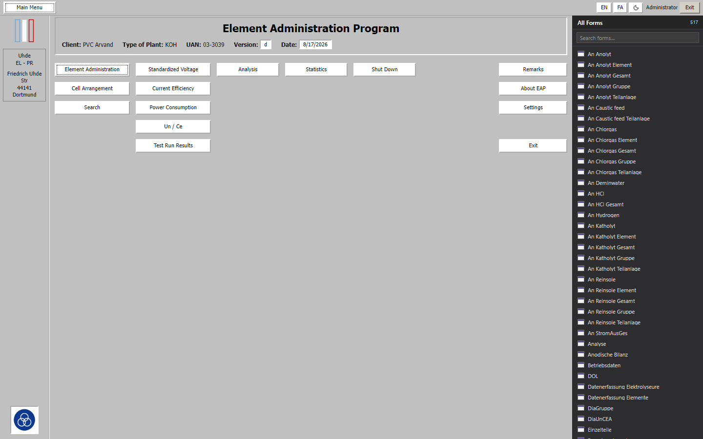
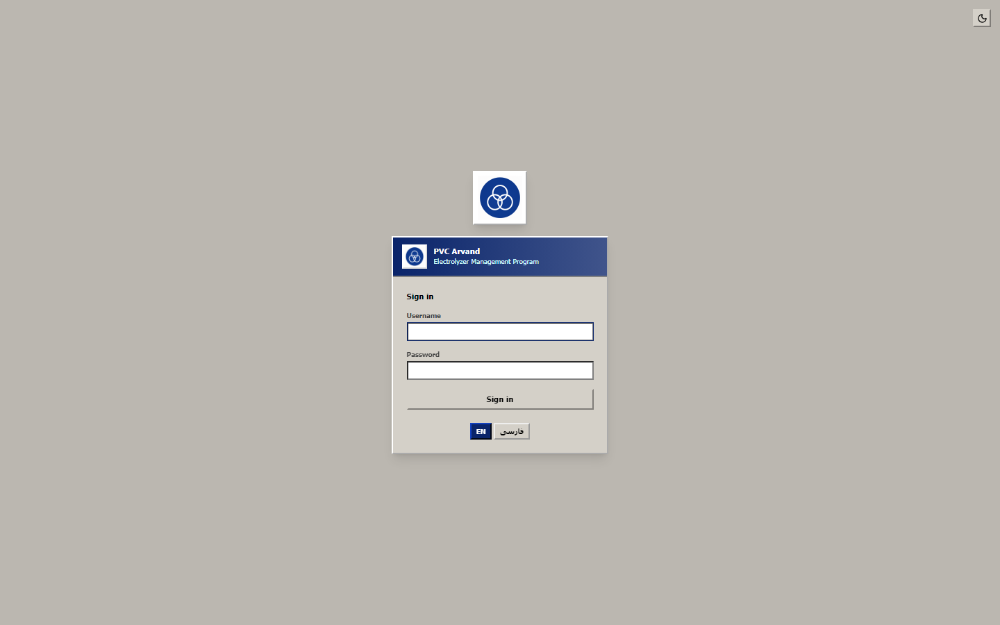
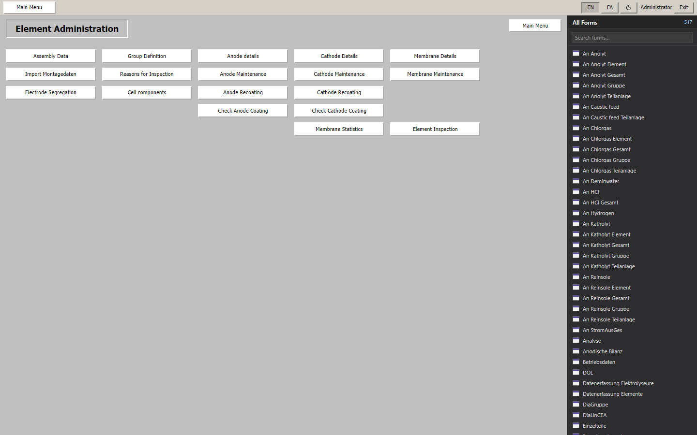
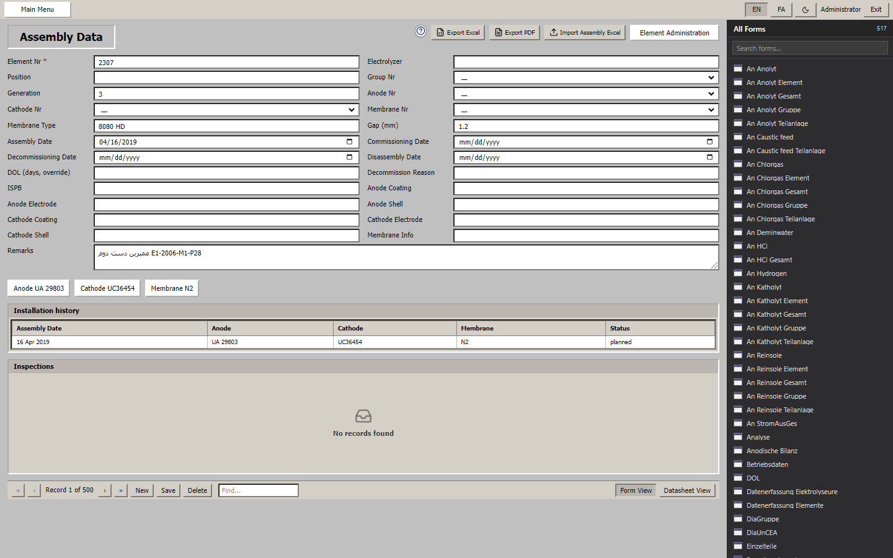
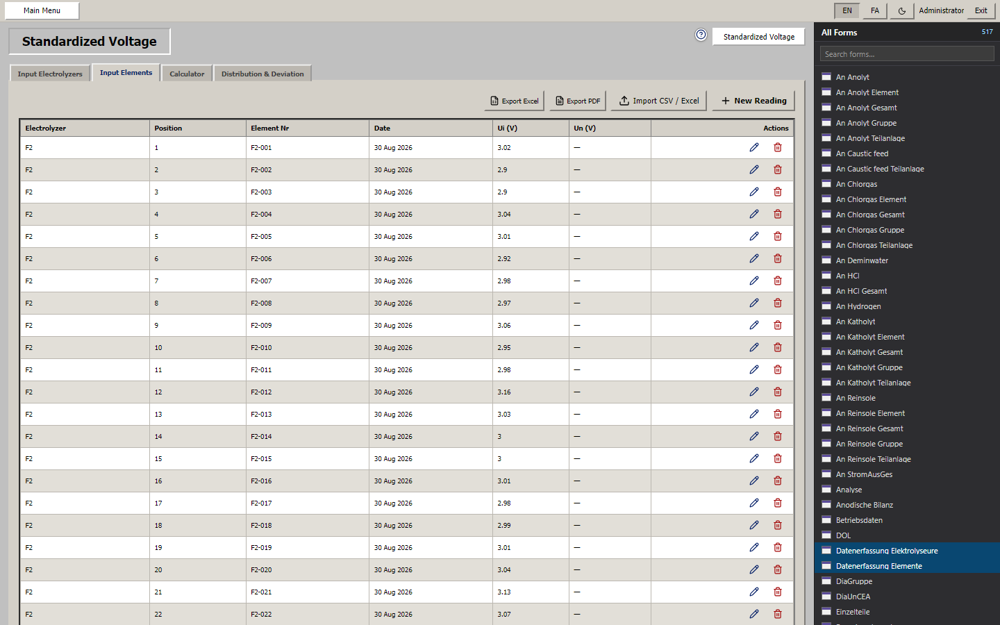
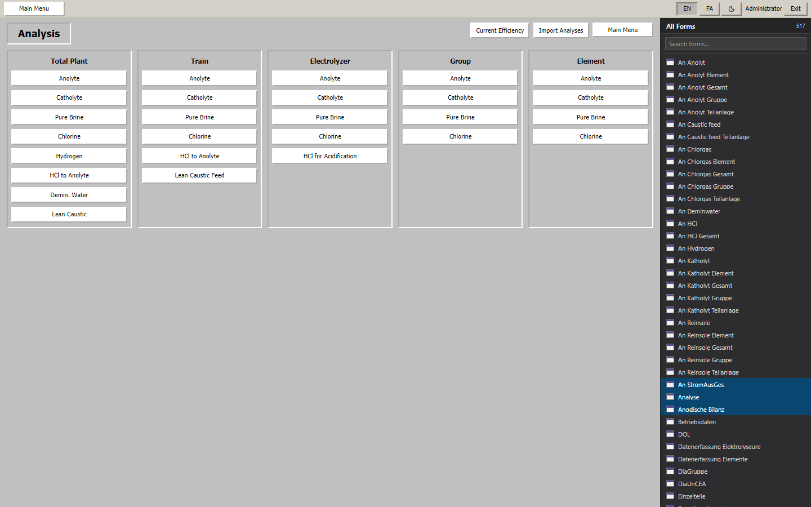
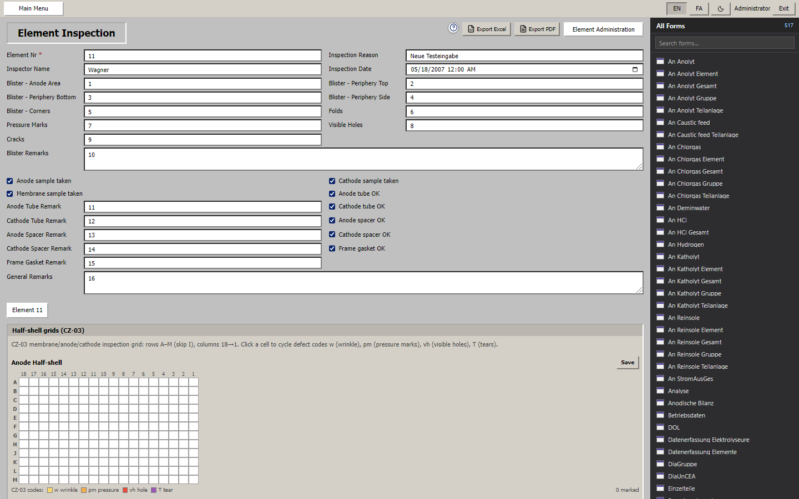
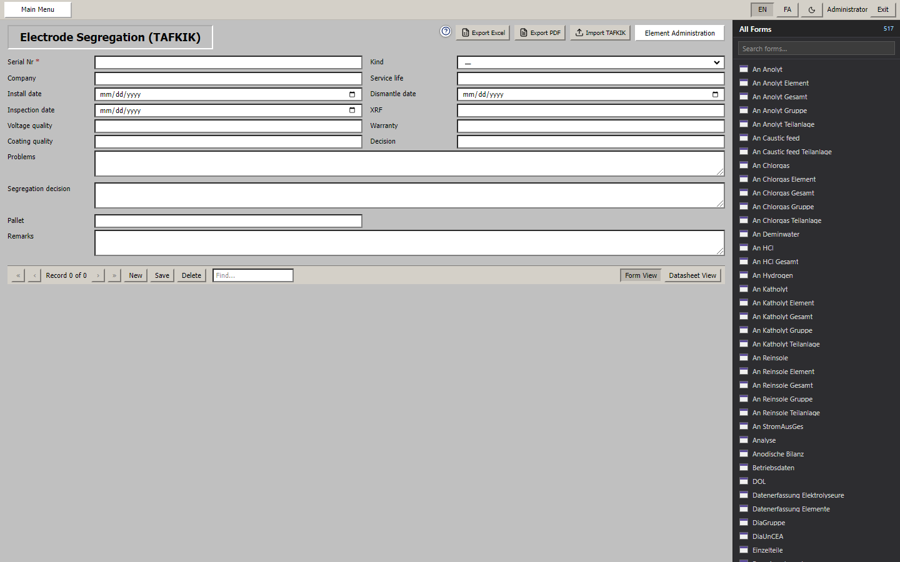
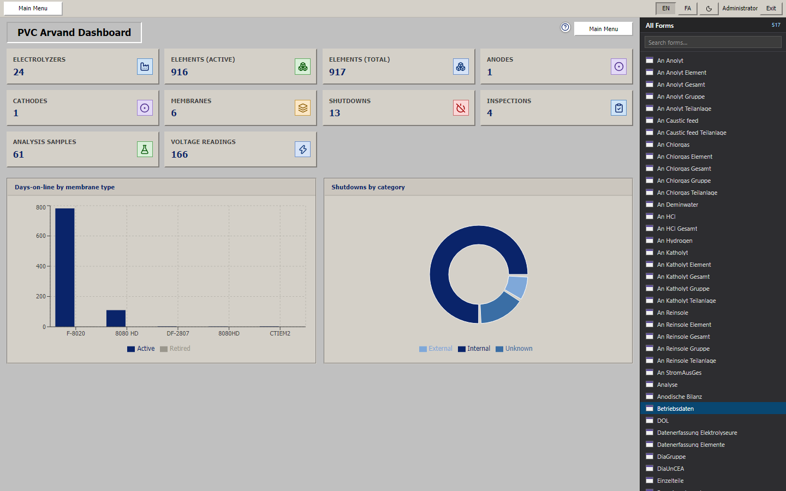

# PVC Arvand — Electrolyzer Management System

Modern **Next.js + FastAPI** replacement for the legacy **Uhde Administrator** (Microsoft Access) used at the PVC Arvand chlor-alkali electrolysis plant.

Access-faithful UI (Main Menu, All Forms, record navigation) with bilingual **English / فارسی**, JWT RBAC, plant Excel importers (SiteMan voltage, LIMS lab, assembly lifecycle, TAFKIK segregation), and CZ-03 inspection defect grids.

<p align="center">
  
</p>

> **Licensing & legal:** [`LICENSE.md`](./LICENSE.md) · [`EULA.md`](./EULA.md) · [`TERMS_OF_USE.md`](./TERMS_OF_USE.md) · [`PRIVACY_POLICY.md`](./PRIVACY_POLICY.md) · [`SECURITY.md`](./SECURITY.md)

---

## Screenshots

| Login | Main Menu (Uhde EAP) |
|:---:|:---:|
|  |  |

| Element Administration | Assembly Data |
|:---:|:---:|
|  |  |

| Voltage readings (F2 Excel import) | Chemical Analysis |
|:---:|:---:|
|  |  |

| Element Inspection (CZ-03 grids) | Electrode Segregation (TAFKIK) |
|:---:|:---:|
|  |  |

| Plant Overview |
|:---:|
|  |

---

## Why this exists

The plant historically ran **Uhde Administrator** on Access (`.mdb`). This project:

1. Migrates plant data into a normalized **SQLite** schema  
2. Re-implements engineering formulas (standardized voltage, CE, DOL, …)  
3. Preserves Access form names / navigation (500+ forms in **All Forms**)  
4. Adds modern auth, backups, Excel/PDF export, and **plant-native Excel importers** for real PVC Arvand workbooks  

---

## Architecture

```
pvc_arvand_web/
├── backend/     FastAPI + SQLAlchemy + SQLite REST API
├── frontend/    Next.js (App Router) + TypeScript + Tailwind
├── packaging/   Windows portable / installer scripts
└── docs/        Screenshots, deploy notes, debug report
```

| Layer | Stack |
|-------|--------|
| API | Python 3 · FastAPI · SQLAlchemy · Pydantic · JWT + bcrypt |
| UI | Next.js · React Query · Recharts · EN/FA + RTL |
| Data | SQLite (`backend/instance/`) · Access migration via `pyodbc` |
| Deploy | Portable Windows zip · Docker Compose · optional static SPA from API |

---

## Features

### Core plant modules
- **Element Administration** — assembly / install / dismantle lifecycle  
- **Anodes / Cathodes / Membranes** — inventory, maintenance, recoating, coating checks  
- **Inspections** — blister findings + **CZ-03** interactive grids (A–M skip I, cols 18→1, codes `w` / `pm` / `vh` / `T`)  
- **Electrode Segregation (TAFKIK)** — workshop warranty / coating / pallet decisions + Excel import  
- **Voltage & CE** — normalizations, readings, SiteMan/F2 Excel + CSV import, Un calculator, distribution  
- **Analyses** — hierarchical LIMS lab Excel import (caustic train sample format)  
- **Shutdowns · Statistics · Reports · Search · Remarks · Settings · Users/RBAC · Backups**

### Plant Excel importers (PVC Arvand sample formats)
| Plant file | Import path |
|------------|-------------|
| Electrolyzer F2 voltage (SiteMan wide layout) | Voltage → **Import CSV / Excel** |
| Lab analysis (hierarchical LIMS) | Analysis → **Import Analyses** |
| مونتاژ - نصب و دی مونتاژ | Assembly Data → **Import Assembly Excel** |
| TAFKIK segregation workbook | `/segregation` → **Import TAFKIK** |
| inspection cell.pdf (CZ-03 scan) | Manual entry on Inspection grids (no OCR) |

Parsers live in `backend/app/plant_import.py` (Jalali dates, Persian columns, SiteMan operator text scrubbing).

---

## Quick start

### Prerequisites
- Python 3.11+
- Node.js 20+
- (Optional) Microsoft Access ODBC driver — only for `.mdb` migration

### Backend

```powershell
cd backend
python -m venv .venv
.\.venv\Scripts\pip install -r requirements.txt
copy .env.example .env
.\.venv\Scripts\python.exe -m uvicorn app.main:app --host 127.0.0.1 --port 8010
```

API: `http://127.0.0.1:8010` · Docs: `/docs` · Health: `/health`

### Frontend

```powershell
cd frontend
npm install
# frontend/.env.local
# NEXT_PUBLIC_API_URL=http://127.0.0.1:8010/api
npm run dev
```

Open `http://localhost:3000`.

### First login
Default admin is seeded from `DEFAULT_ADMIN_USERNAME` / `DEFAULT_ADMIN_PASSWORD` in config (see `backend/app/config.py`). **Change the password immediately** — details in [`SECURITY.md`](./SECURITY.md).

### Access migration (optional)

```powershell
cd backend
.\.venv\Scripts\python.exe -m app.migrate_access
```

Or use **Settings → Import / Export** in the UI.

---

## Windows portable / Docker

See [`docs/DEPLOY.md`](./docs/DEPLOY.md).

- **Workstation:** extract `packaging/output/PVCArvand-Windows.zip` and run the installer / `PVCArvand.exe`  
- **Server:** `docker compose up -d --build` → `http://SERVER:8080/`

---

## Application map

| Area | Route |
|------|--------|
| Main Menu | `/` |
| Element Admin | `/elements` |
| Assembly Data | `/elements/assembly` |
| Voltage | `/voltage` |
| Analysis | `/analyses` |
| Inspections | `/inspections` |
| TAFKIK Segregation | `/segregation` |
| Overview / Reports | `/overview`, `/reports` |
| Settings / Users | `/settings`, `/users` |

---

## Development notes

- Engineering formulas: `backend/app/calculations.py`  
- Typed API client: `frontend/src/lib/endpoints.ts`  
- Access form name → route map: `frontend/src/lib/access-form-routes.ts`  
- Screenshot capture (prod UI): `frontend/scripts/capture-screenshots.js` against `next start`

---

## Security

Do **not** commit real plant databases, JWT secrets, or production `.env` files. Rotate `JWT_SECRET_KEY` and the default admin password before any shared/production deployment. See [`SECURITY.md`](./SECURITY.md).

---

## License

See [`LICENSE.md`](./LICENSE.md) and related legal documents in the repository root.

---

**Built for Arvand Petrochemical / PVC electrolyzer operations** — preserving Uhde EAP workflows while shipping a maintainable web stack.
